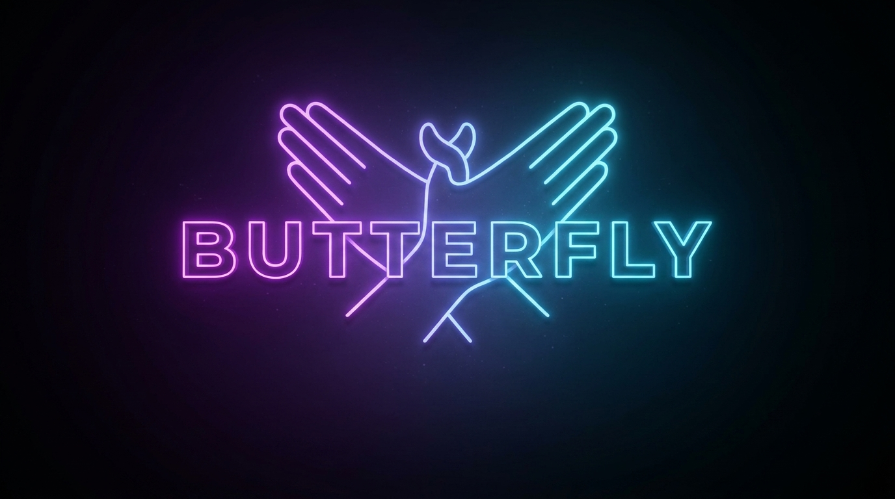

<p align="center">
  
</p>

# 🦋 Butterfly: macOS Native Real-Time Dual-Mode Speech-to-Text & Note Polisher

> **Butterfly**: Liberate your hands from the keyboard and let your thoughts fly freely with hands-free voice dictation and intelligent note structuring.

A lightweight, privacy-focused, zero-cloud-dependency local speech-to-text tool built for macOS (Apple Silicon). Whenever your cursor is focused in any text input or application, press a global hotkey to transcribe mixed Chinese and English speech with real-time streaming or smart note structuring into Traditional Chinese (Taiwan standard / OpenCC s2twp).

---

## ✨ Key Features

1. **Dual Voice Input Modes**:
   - **🎙️ Mode 1: Live Streaming Dictation (`Option + Space`)**:
     - 100% faithful real-time streaming speech-to-text directly into your active cursor.
     - 1~2 second sliding window in-place refinement (revises tech terms, numbers, and units without disturbing earlier text).
     - Preserves all natural spoken words, repetitions, and punctuation without aggressive deletion.
   - **📝 Mode 2: Record & Smart Polish (`Option + Shift + Space`)**:
     - Complete, uninterrupted recording of long monologues, meetings, and thoughts.
     - Automatic deep filler filtering (`呃`, `啊`, `哦`, `那個那個`, `就是說`), stutter cleaning, intelligent paragraph structuring, and Markdown bullet point extraction (`- ...`).
     - One-shot paste into the active window with clipboard protection.
2. **Accidental Send Protection with Low-Level `CGEventTap`**:
   - Press <kbd>Enter</kbd> (or <kbd>Esc</kbd>) to stop recording.
   - The first <kbd>Enter</kbd> is intercepted and swallowed at the OS level so it **never accidentally sends messages in Slack, Discord, ChatGPT, or Cursor**!
   - The second <kbd>Enter</kbd> passes through normally to submit your polished text.
3. **External Editable `SYSTEM_PROMPT.md`**:
   - System Prompt is fully decoupled into `SYSTEM_PROMPT.md` at project root or `~/.config/butterfly/SYSTEM_PROMPT.md` for seamless customization without recompiling.
4. **Seamless Code-Switching & Cognitive Intent Reconstruction**:
   - Accurately recognizes mixed Chinese and English speech (e.g., `Mode 1`, `Mode 2`, `System Prompt`, `Context`, `Source Code`, `README`, `AGENTS.md`, `Local Data`).
   - Normalizes spoken numbers (`八百多 MB` $\rightarrow$ `800 多 MB`, `one thousand` $\rightarrow$ `1000`) and metric/digital units (`MB`, `GB`, `TB`, `kg`).
5. **Guaranteed Traditional Chinese Output (Zero Simplified Chinese)**:
   - Integrates OpenCC `s2twp` dictionary to convert all recognized Chinese into Taiwan Traditional Chinese standards (`伺服器`, `記憶體`, `程式碼`), while preserving original English terms.
6. **Prioritized Model Whitelist & Apple Silicon Hardware Acceleration**:
   - Automatically detects and loads high-precision models (Rank 1: `Whisper Large-v3-Turbo` $\rightarrow$ Rank 6: `Apple Speech Native`).
   - Hardware accelerated via Apple Neural Engine (ANE / NPU) and Metal GPU for ultra-low latency.

---

## 📁 Repository Structure

```text
butterfly/
├── SYSTEM_PROMPT.md             # External editable system prompt & vocabulary rules
├── docs/
│   ├── ARCHITECTURE.md          # Architecture & pipeline data flow diagrams
│   ├── TEST_PLAN.md             # Test plan & quality assurance matrix
│   └── IMPLEMENTATION_PLAN.md   # Implementation roadmap & design details
├── AGENTS.md                    # Agent instructions & engineering guidelines
├── Package.swift                # Swift Package Manager configuration (macOS 13+)
├── Sources/
│   ├── ButterflyCore/           # Core framework library
│   │   ├── Audio/               # Audio capture & VAD detection
│   │   ├── Engine/              # Inference backend, LiveSpeechEngine, ModelManager, SystemPrompt
│   │   ├── Injector/            # CGEvent keyboard injector & clipboard proxy
│   │   ├── State/               # State machine coordinator
│   │   └── Text/                # OpenCC s2twp, TextFormatter, TextPolisher
│   ├── ButterflyCLI/            # Command-line interface for testing & benchmarking
│   └── ButterflyApp/            # Native macOS menu bar application with CGEventTap
└── Tests/
    └── ButterflyTests/          # Unit test suites
```

---

## 🚀 Quick Start

### 1. Build the Project
```bash
swift build
```

### 2. Run CLI Commands
```bash
# List supported local models and download status
swift run butterfly-cli models

# Display hardware acceleration and cache directory info
swift run butterfly-cli info

# Test text polishing, bullet points, and filler removal
swift run butterfly-cli test-polish "我想一個 System Prompt 之類的，我們有兩種模式需求，第一點是即時串流，第二點是錄音智慧整理。"

# Start Live Streaming Dictation in terminal
swift run butterfly-cli listen

# Start Record & Smart Polish mode in terminal
swift run butterfly-cli listen --polish
```

### 3. Launch the macOS Menu Bar App
```bash
swift run ButterflyApp
```

Once launched, the 🦋 icon will appear in your macOS menu bar:
- Press <kbd>Option</kbd> + <kbd>Space</kbd> to start **Mode 1: Live Streaming Dictation**.
- Press <kbd>Option</kbd> + <kbd>Shift</kbd> + <kbd>Space</kbd> to start **Mode 2: Record & Smart Polish**.
- Press <kbd>Enter</kbd> (or <kbd>Esc</kbd>) to **Stop & Finalize** (First Enter stops recording without sending; Second Enter submits).
