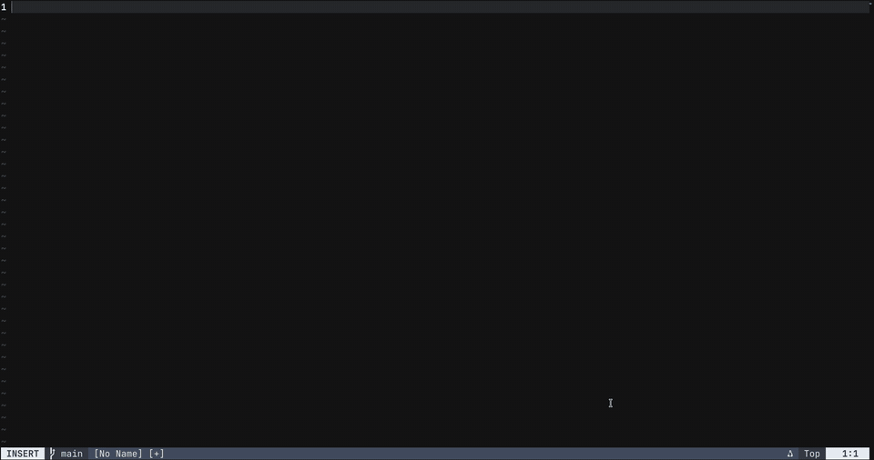
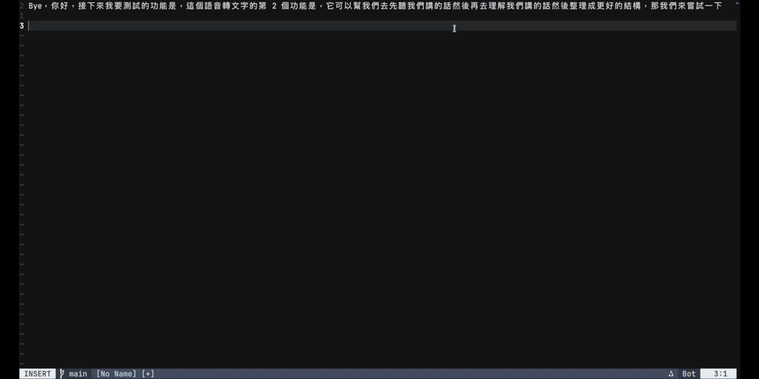

<p align="center">
  
</p>

# 🦋 Butterfly

Butterfly is a native voice dictation tool for Apple Silicon Macs. It can type speech into any focused app as you talk, or record first and polish the completed transcript before inserting it.

Speech recognition can run locally with Whisper. Smart Polish can use Apple Foundation Models, local rules, or an OpenAI-compatible endpoint that you configure.

## Quick start

Butterfly requires an Apple Silicon Mac running macOS 13 or later. Internet access and administrator approval may be needed during the first setup.

From the repository root, run:

```bash
./run.sh
```

On the first run, the script:

1. Checks your Mac and developer tools.
2. Helps install Xcode Command Line Tools and Homebrew when missing.
3. Installs the `whisper-cpp` runtime with Homebrew.
4. Builds and signs `.build/app/Butterfly.app`.
5. Opens Butterfly.

Whisper model files are downloaded separately from the Butterfly menu. Until then, Butterfly uses **Apple Speech Native**.

## Use Butterfly

| Shortcut | Action |
| --- | --- |
| `Option + Space` | Start or stop **Live Voice Dictation**. Text streams into the focused app while you speak. |
| `Option + Shift + Space` | Start or stop **Record & Smart Polish**. Butterfly records silently, polishes once, then inserts the result. |
| `Enter` or `Esc` | Stop the current recording. The first Enter is swallowed to prevent accidental submission. |

The same recording actions are available from the menu bar. The floating panel shows a waveform during recording and text while Smart Polish is processing.

## Demos

**Mode 1 — Live Voice Dictation**

Press `Option + Space` to stream transcription directly into the focused app while the panel displays the microphone waveform.

<p align="center">
  <a href="docs/assets/mode1.mp4">
    
  </a>
</p>

**Mode 2 — Record &amp; Smart Polish**

Press `Option + Shift + Space` to record without inserting partial text. Butterfly polishes the completed transcript and inserts the final result once.

<p align="center">
  <a href="docs/assets/Mode2.mp4">
    
  </a>
</p>

Click either preview to open the compressed MP4 demo.

## Permissions

Building Butterfly does not grant or require app privacy permissions. macOS asks for them after the app launches or when recording starts.

| Permission | When it is requested | What it enables |
| --- | --- | --- |
| **Accessibility** | First app launch | Global hotkeys, Enter/Esc interception, and text insertion. |
| **Microphone** | First recording | Audio capture in both recording modes. |
| **Speech Recognition** | First recording with Apple Speech Native | Apple's built-in speech recognition. Downloaded Whisper models do not use this permission. |

Enable Accessibility for the exact `.build/app/Butterfly.app` that is running. The menu displays `Global Hotkeys: Ready` when registration succeeds.

### After rebuilding

Local builds use an ad-hoc signature. A rebuild can make macOS treat Butterfly as a new app and invalidate the previous Accessibility grant.

If the menu shows `Hotkeys unavailable` after `--build`, `--debug`, or `--clean`:

1. Quit Butterfly.
2. Open **System Settings → Privacy & Security → Accessibility**.
3. Remove the old Butterfly entry.
4. Add the current `.build/app/Butterfly.app`.
5. Enable it and launch Butterfly again.

Running `./run.sh` without build options reuses the existing signed app and normally preserves its permission. See [macOS signing and Accessibility](docs/MACOS_SIGNING_AND_ACCESSIBILITY.md) for the underlying certificate and TCC behavior.

## Speech models

Choose and download models from **Speech Model** in the Butterfly menu.

- **Whisper Large-v3-Turbo** offers the highest accuracy and uses about 1.6 GB.
- **Whisper Small**, **Base**, and **Tiny** trade accuracy for smaller downloads and faster startup.
- **Apple Speech Native** is built into macOS and requires Speech Recognition permission.

Downloaded models are stored in `~/.cache/butterfly/models`. Butterfly chooses the highest-ranked downloaded model unless you select another one. SenseVoice Small appears in the catalog but remains disabled because the bundled runtime does not support it.

## Smart Polish

Smart Polish can use:

- `local/foundation` — Apple Foundation Models on macOS 26 or later with Apple Intelligence.
- `local/rules` — deterministic local editing without an AI model.
- A custom OpenAI-compatible endpoint.

If the selected AI model is unavailable, Butterfly reports the reason and uses the local rules fallback.

### Configure the default model

Butterfly reads Smart Polish settings from:

```text
~/.config/butterfly/butterfly.json
```

Copy the safe sample, then edit your local copy:

```bash
mkdir -p ~/.config/butterfly
cp butterfly.sample.json ~/.config/butterfly/butterfly.json
```

Set `polish.defaultModel` to a built-in ID or `<provider-id>/<model-id>`. See [`butterfly.sample.json`](butterfly.sample.json) and [endpoint configuration](docs/POLISH_ENDPOINTS.md) for provider options, API variants, limits, and environment placeholders.

The **Smart Polish Model** menu overrides the configured default only for the current app session. Restarting the app or choosing **Reload Polish Configuration** returns to `polish.defaultModel`. Existing configurations using `polish.model` remain supported.

### Choose an editing style

| Style | Result |
| --- | --- |
| **Faithful Proofread** | Fix punctuation and boundaries while preserving wording and detail. |
| **Concise Polish** | Remove fillers, stutters, and redundant repetition. This is the default. |
| **Structured Notes** | Add useful headings and lists while keeping paragraph-first notes. |
| **Summary** | Keep the main ideas, decisions, caveats, and conclusions. |

The selected style persists between launches. You can override the bundled prompt with `~/.config/butterfly/SMART_POLISH_PROMPT.md`.

<details>
<summary><strong>Build and launch options</strong></summary>

| Command | Behavior |
| --- | --- |
| `./run.sh` | Open the existing app, or build it when it does not exist. |
| `./run.sh --build` | Rebuild a release app and open it. |
| `./run.sh --debug` | Rebuild a debug app and open it. |
| `./run.sh --release` | Rebuild a release app and open it. |
| `./run.sh --clean` | Clean SwiftPM artifacts, rebuild, and open the app. |
| `./run.sh --no-open` | Build and sign without opening the app. |
| `./run.sh --no-build` | Open an existing app without rebuilding or signing it. |

Use `swift build` for a package build and `swift run ButterflyApp` for development. These commands do not create the packaged `.build/app/Butterfly.app` used by the normal workflow.

</details>

<details>
<summary><strong>CLI commands</strong></summary>

```bash
swift run butterfly-cli listen
swift run butterfly-cli models
swift run butterfly-cli download whisper-large-v3-turbo
swift run butterfly-cli info
swift run butterfly-cli test
swift run butterfly-cli test-polish --smart --style structured
swift run butterfly-cli test-convert "服务器内存不足"
```

The CLI uses the same model cache and Smart Polish configuration as the app. `butterfly-cli test` runs the zero-dependency core regression suite; `swift test` runs XCTest targets.

</details>

<details>
<summary><strong>Files and directories</strong></summary>

| Path | Purpose |
| --- | --- |
| `.build/app/Butterfly.app` | Packaged application created by `run.sh`. |
| `~/.cache/butterfly/models` | Downloaded Whisper models. |
| `~/.config/butterfly/butterfly.json` | Smart Polish providers and startup default. |
| `~/.config/butterfly/dictionary.txt` | Personal speech-recognition vocabulary. |
| `~/.config/butterfly/SMART_POLISH_PROMPT.md` | Optional Smart Polish prompt override. |
| `Sources/ButterflyCore/Resources/dictionary.txt` | Bundled speech-recognition vocabulary. |

Keep personal configuration and credentials outside version control. The repository sample contains only generic names and environment-variable placeholders.

</details>

## Troubleshooting

### `Hotkeys unavailable`

Confirm that Accessibility is enabled for the current `.build/app/Butterfly.app`. If you recently rebuilt, follow the [rebuild recovery steps](#after-rebuilding).

### `The language model is unavailable`

Check the selected Smart Polish model and validate `~/.config/butterfly/butterfly.json`. For an endpoint model, ensure referenced environment variables are available to the launched app. For `local/foundation`, confirm macOS 26 or later and Apple Intelligence. Butterfly uses local rules when the primary model is unavailable.

### Recording does not start

Grant Microphone permission. Also grant Speech Recognition when Apple Speech Native is selected. For Whisper, download a supported model from the **Speech Model** menu.

## More documentation

- [Architecture](docs/ARCHITECTURE.md)
- [Smart Polish endpoints](docs/POLISH_ENDPOINTS.md)
- [Test plan](docs/TEST_PLAN.md)
- [macOS signing and Accessibility](docs/MACOS_SIGNING_AND_ACCESSIBILITY.md)
