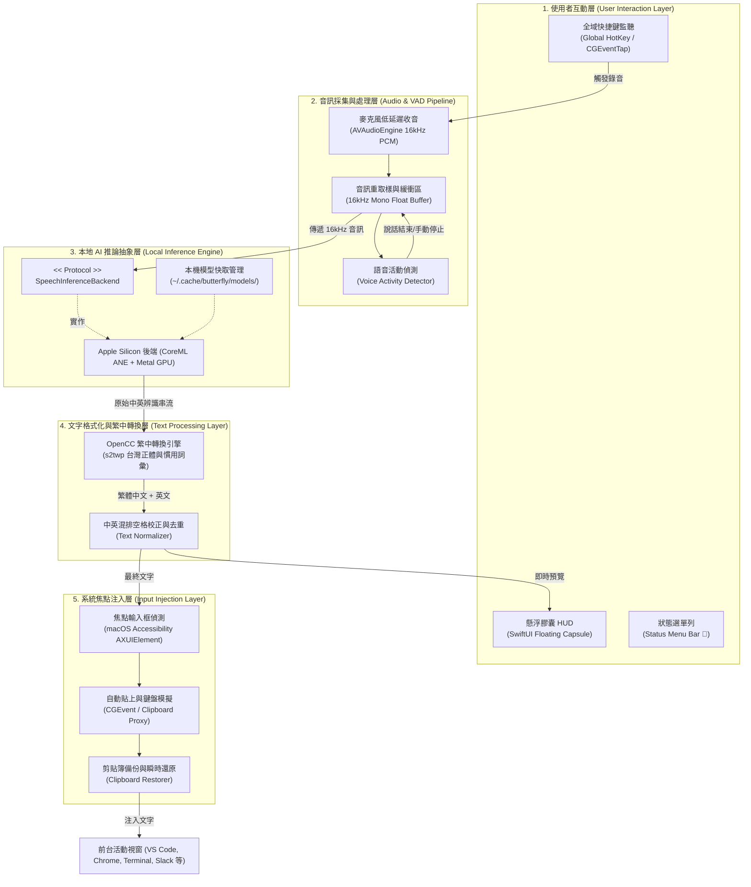
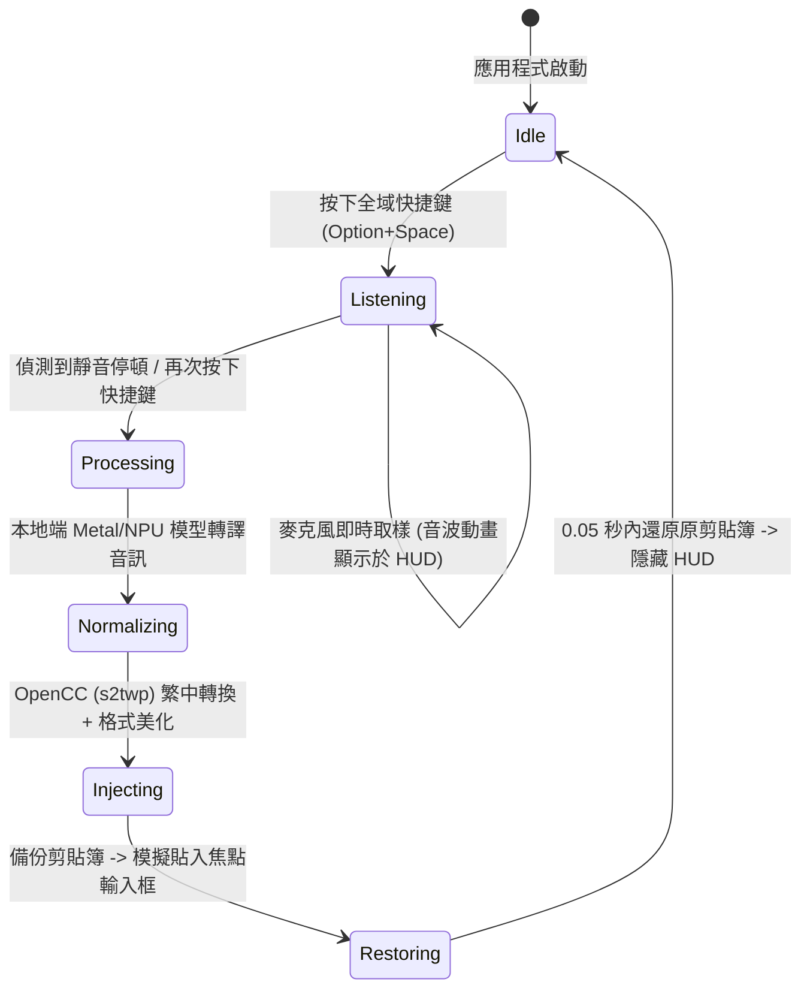

# Butterfly 系統架構設計文件 (System Architecture)

## 1. 專案概念與使命 (Concept & Mission)

> **Butterfly（蝴蝶）**  
> **寓意**：解放雙手，無需碰觸鍵盤，讓雙手如蝴蝶雙翼般自由展翅（Hands-Free Voice Dictation）。  
> **使命**：專為 macOS (Apple Silicon) 打造的極致輕量、零雲端依賴的本地端語音輸入工具。在任何輸入框聚焦時，一鍵語音輸入，即時中英雙語混雜辨識，並強制轉換為標準台灣繁體中文輸出。

---

## 2. 系統架構圖 (System Architecture Diagram)

---

## 3. 核心狀態機與生命週期 (State Machine)

---

## 4. 可插拔硬體推論協定 (Pluggable Backend Protocol)

核心推論層採用抽象協定設計，上層所有繁中轉換、排版、VAD 與測試案例完全與底層硬體解耦：

- **macOS (v1)**：`AppleSiliconInferenceBackend`（榨取 CoreML ANE 與 Metal GPU 算力）。
- **Windows (v2 擴充)**：`WindowsNPUBackend`（支援 Qualcomm QNN、Intel OpenVINO、DirectML）。
