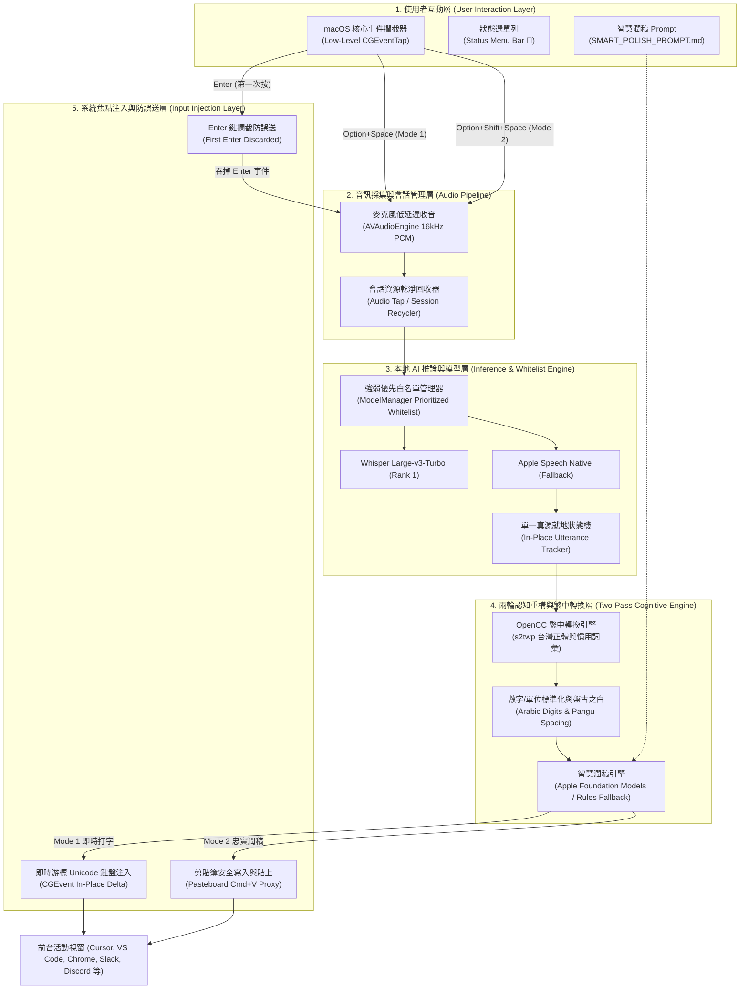
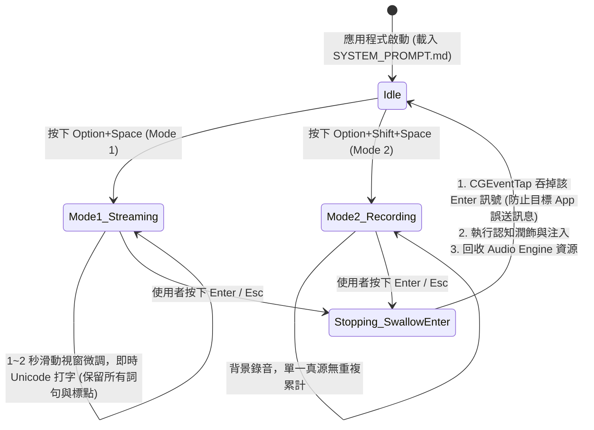

# Butterfly 系統架構設計文件 (System Architecture)

## 1. 專案概念與使命 (Concept & Mission)

> **Butterfly（蝴蝶）**  
> **寓意**：解放雙手，無需碰觸鍵盤，讓雙手如蝴蝶雙翼般自由展翅（Hands-Free Voice Dictation）。  
> **使命**：專為 macOS (Apple Silicon) 打造的極致輕量、零雲端依賴的本地端語音輸入與筆記重構工具。在任何輸入框聚焦時，一鍵語音輸入，即時中英雙語混雜辨識，並強制轉換為標準台灣繁體中文輸出。

---

## 2. 系統架構圖 (System Architecture Diagram)

---

## 3. 雙模式運作與防誤送狀態機 (Dual-Mode & Safety State Machine)

---

## 4. 關鍵技術模組 (Key Technical Modules)

1. **`SmartPolishPrompt.swift` & `SMART_POLISH_PROMPT.md`**：
   - Mode 2 使用獨立提示詞，支援使用者覆寫且不影響 Whisper 詞彙偏置。
2. **`TextPolisher.swift`（兩輪認知意圖重構）**：
   - **Pass 1**：數字（`800`）、單位（`MB`, `GB`, `TB`, `kg`）與無邊界音素科技詞彙校正（`Mode 1`, `Mode 2`, `System Prompt`, `Context`, `Source Code`, `README`, `AGENTS.md`）。
   - **Pass 2**：Mode 1 嚴格非破壞性忠實輸出；Apple Intelligence 不可用時為 Mode 2 提供規則式 fallback。
3. **`LiveSpeechEngine.swift`（單一真源狀態機）**：
   - 廢除重複字串拼接，採用 `state.committed` + `state.active` 就地更新，徹底消除錄音時重複產生 3~4 次相同句子的問題。
4. **`ButterflyApp.swift`（低階 `CGEventTap` 核心攔截）**：
   - 註冊 `.cgSessionEventTap`，在錄音結束時吞掉 Enter 鍵，實現「第一次 Enter 結束錄音，第二次 Enter 才送出訊息」的安全保護。
