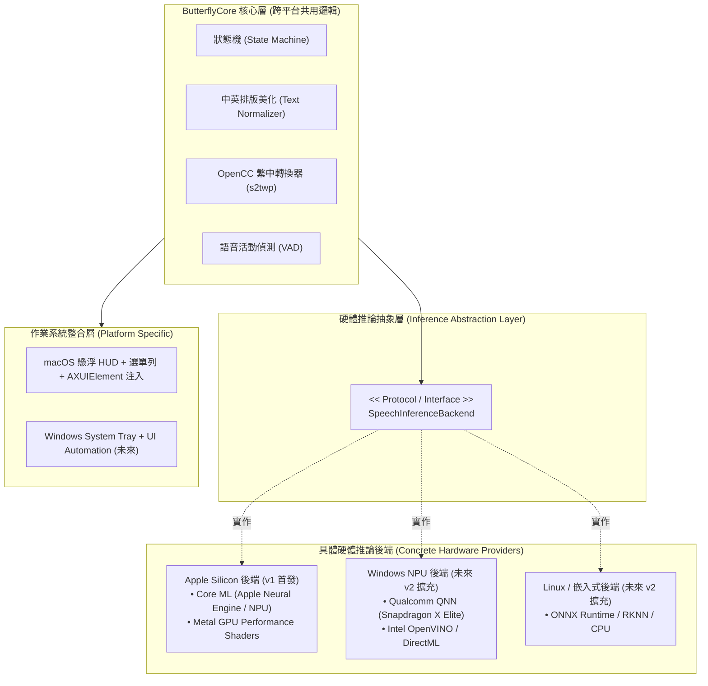
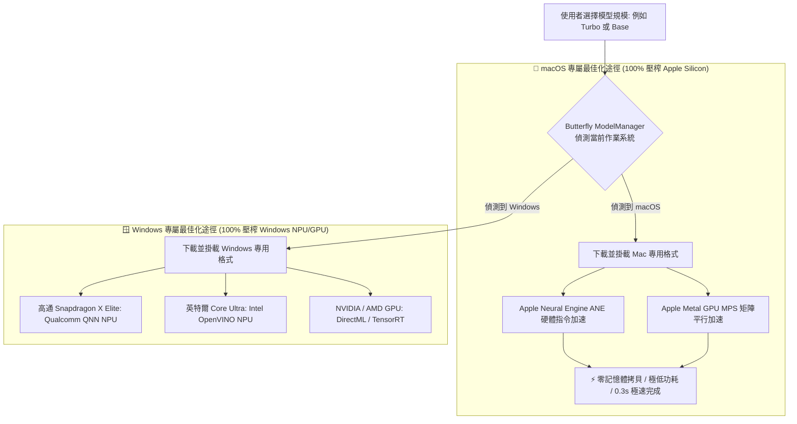
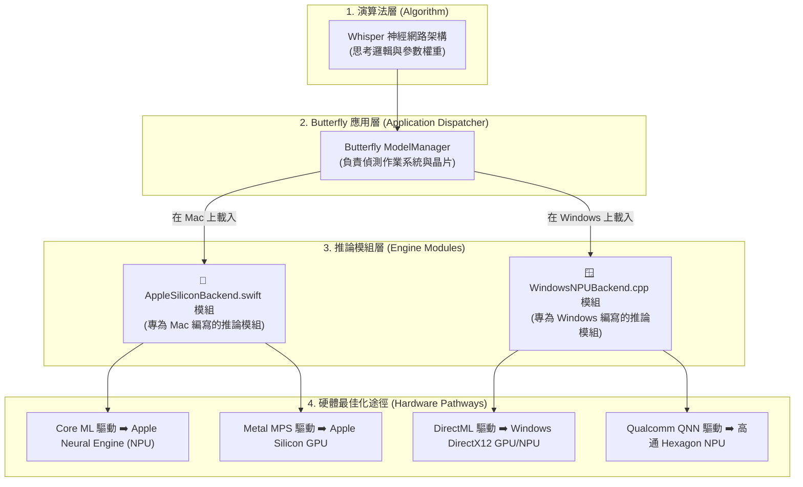
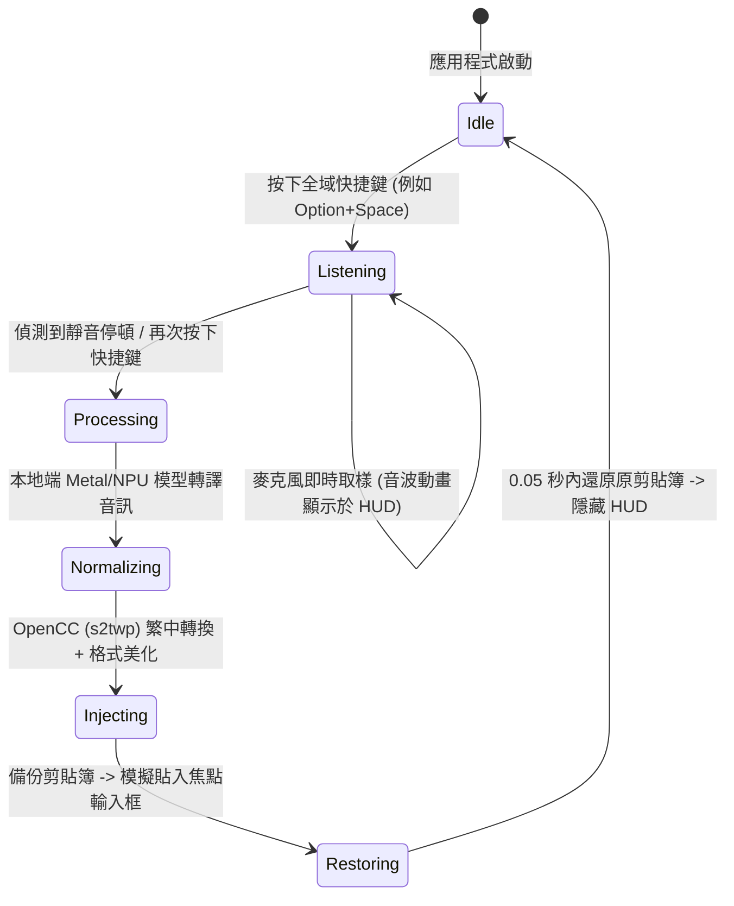

# Butterfly: macOS 本地端雙語即時語音轉文字工具（實作規劃與架構設計書）

## 1. 專案概念與目標 (Goal & Concept)

> **專案命名：Butterfly（蝴蝶）**  
> **概念寓意**：解放雙手，無需碰觸鍵盤，讓雙手如蝴蝶雙翼般自由展翅（Hands-Free Voice Dictation）。  
> **核心使命**：
> - **第一版 (v1)**：專為 **macOS (Apple Silicon)** 打造極致輕量、無雲端依賴的本地端語音輸入工具。在任何輸入框聚焦時，一鍵語音輸入，即時中英雙語混雜辨識，並強制轉換為標準台灣繁體中文輸出。
> - **未來擴充性 (Future-Proof)**：採用 **可插拔推論後端協定 (Pluggable Backend Protocol)**，預留未來擴充其他作業系統 NPU（如 Windows Copilot+ PC 的 Qualcomm QNN、Intel OpenVINO、AMD Ryzen AI）之抽換介面，達成核心商業邏輯與底層硬體運算完全解耦。

---

## 2. 系統架構與可插拔 NPU 擴充設計 (Pluggable Architecture)



---

## 3. 模型候選清單、規格矩陣與平台專屬最佳化分析 (Model Matrix & Platform Strategy)

### 3.1 完整模型候選規格對照表

| 模型名稱                                | 參數量 (Params)     | 檔案體積 (Size)  | 中英雙語混說能力        | 延遲 (Latency)      | Mac 專屬最佳化途徑                       | Windows 專屬最佳化途徑             | 最佳適用場景                |
| :---------------------------------- | :--------------- | :----------- | :-------------- | :---------------- | :-------------------------------- | :-------------------------- | :-------------------- |
| **Whisper Tiny**                    | 39M (3,900萬)     | **約 75 MB**  | 基礎（偶有漏詞）        | < 0.05 秒          | CoreML ANE + Metal GPU            | DirectML / QNN NPU          | 極致輕量、簡單單詞輸入           |
| **Whisper Base**                    | 74M (7,400萬)     | **約 140 MB** | 良好              | < 0.1 秒           | CoreML ANE + Metal GPU            | DirectML / QNN NPU          | 輕巧流暢、日常隨想筆記           |
| **Whisper Small**                   | 244M (2.44億)     | **約 460 MB** | 非常好             | < 0.25 秒          | CoreML ANE + Metal GPU            | OpenVINO / DirectML         | 專業技術詞彙、長句輸入           |
| **Whisper Large-v3-Turbo** *(旗艦推薦)* | **809M (8.09億)** | **約 800 MB** | **極佳 (最強混雜能力)** | < 0.4 秒           | **CoreML ANE + Metal GPU (最佳推薦)** | **DirectML / ONNX-QNN**     | **技術專用、程式碼中英夾雜、專業溝通** |
| **SenseVoice Small (FunASR)**       | 234M (2.34億)     | **約 220 MB** | 極佳 (中/英/日/粵)    | **< 0.03 秒 (極速)** | CoreML 模型編譯                       | ONNX Runtime + OpenVINO/QNN | 極致即時即打即出字體驗           |

---

### 3.2 跨平台通用 vs 平台專屬最佳化：會不會因為跨平台而降低 Mac 效能？

您的考量非常正確！如果在 Mac 上使用未經針對 Apple Silicon 最佳化的通用推論引擎（例如純 CPU ONNX），效能會大幅下降 5~10 倍。

因此 Butterfly 採用 **「雙軌專屬最佳化策略 (Dual-Track Platform-Optimized Strategy)」**：**不妥協任何平台的效能，Mac 上只跑 Mac 專屬最佳化，Windows 上只跑 Windows 專屬最佳化！**



### 3.3 各平台專屬最佳化細節說明

1. **Mac 專用最佳化（v1 首發核心）**：
   - **專屬技術**：Apple 原生 `Core ML`（編譯為 `.mlmodelc` 交由 16 核心 ANE 專屬運算）+ `whisper.cpp` 原生 Metal 著色器。
   - **優勢**：利用 Apple Silicon 的**統一記憶體架構（Unified Memory）**，音訊與權重不需在 CPU/GPU 之間跨匯流排拷貝，速度達到最快極限。

2. **Windows 專用最佳化（未來擴充）**：
   - **高通 ARM 筆電 (Copilot+ PC)**：採用 **Qualcomm QNN SDK**，直接將模型量化為高通 Hexagon NPU 專用指令，享有 45 TOPS 算力。
   - **Intel / AMD 筆電**：採用 **Intel OpenVINO NPU 執行單元** 或 **DirectX 12 DirectML** 驅動。

### 3.4 觀念解析：模型 (Model)、推論模組 (Engine Module) 與最佳化途徑 (Hardware Backend) 的關係

許多人會好奇：**「模型」跟「最佳化途徑（如 CoreML ANE、DirectML）」之間到底是什麼關係？是同一個模型可以用不同模組跑嗎？**



#### 簡單生動的比喻：
* **模型 (Model Weights)** = **「樂譜（音樂家的創作）」**
  * 裡面記載了所有旋律（神經網路的權重矩陣）。不論在何處，音符本質是一樣的。
* **推論模組 (Engine Module)** = **「樂團的指揮與樂手（程式模組）」**
  * Mac 上由「蘋果專屬樂團模組（`AppleSiliconBackend`）」來演奏。
  * Windows 上由「微軟專屬樂團模組（`WindowsNPUBackend`）」來演奏。
* **最佳化途徑 (Hardware Pathway / Backend)** = **「專用樂器設備（硬體晶片驅動）」**
  * **CoreML ANE / Metal**：Mac 專屬的頂級音響晶片（Apple NPU/GPU）。
  * **DirectML / QNN**：Windows 專屬的高傳真音效晶片（DirectX / 高通 NPU）。

#### 模型自己會知道它在什麼系統嗎？
* **模型本身只是一份靜態檔案（數字矩陣），它「不會」自己去辨識系統。**
* **是 Butterfly 的軟體程式碼在負責辨識！**
  * 當 Butterfly 啟動時，程式會偵測：「目前運行在 macOS (Apple Silicon)」，接著 Butterfly 就會調用 **Mac 專用模組**，並將模型送入 **CoreML ANE / Metal** 這條專屬高速公路；未來在 Windows 啟動時，Butterfly 則會自動切換調用 **Windows 模組與 DirectML 通道**。

---

## 4. 核心狀態機與生命週期 (State Machine)



---

## 4. 抽象介面設計 (Interface Contract)

為了確保未來新增其他系統 NPU 時**完全不需要重寫上層邏輯與測試**，在 `ButterflyCore` 中定義統一的推論介面協定：

```swift
/// 支援的硬體加速晶片類型
public enum HardwareAccelerator: String, Codable {
    case appleNeuralEngine = "Apple Neural Engine (ANE)"
    case metalGPU          = "Apple Metal GPU"
    case qualcommNPU       = "Qualcomm Hexagon NPU"
    case intelOpenVINO     = "Intel AI Boost NPU"
    case directML          = "DirectML / ONNX Runtime"
    case cpuFallback       = "CPU (Fallback)"
}

/// 辨識結果資料封裝
public struct TranscriptionResult: Equatable {
    public let rawText: String
    public let confidence: Float
    public let latencySeconds: Double
    public let detectedLanguage: String
    public let usedHardware: HardwareAccelerator
}

/// 核心推論抽象協定 (任何硬體後端皆實作此協定)
public protocol SpeechInferenceBackend: AnyObject {
    var availableHardware: [HardwareAccelerator] { get }
    var currentHardware: HardwareAccelerator { get }
    
    func initialize(modelPath: String) async throws
    func transcribe(audioSamples: [Float]) async throws -> TranscriptionResult
    func release()
}
```

---

## 5. 嚴密測試計畫與邏輯測試案例 (Test Plan & Test Cases)

測試案例將全部針對 `ButterflyCore` 與抽象介面編寫，確保無論底層使用哪一種 NPU，輸入輸出邏輯皆堅若磐石：

### 類別 A：繁簡轉換與語言過濾邏輯測試 (`OpenCCTranslatorTests`)

| 編號 | 測試案例名稱 | 輸入 (Input) | 預期輸出 (Expected Output) | 驗證目的 |
| :--- | :--- | :--- | :--- | :--- |
| **TC-A1** | 純簡體字轉換 | `"这是语音识别测试"` | `"這是語音識別測試"` | 驗證基礎簡繁字形替換 |
| **TC-A2** | 台灣慣用詞彙替換 | `"服务器内存不足"` | `"伺服器記憶體不足"` | 驗證 `s2twp` 詞庫慣用語精準轉換 |
| **TC-A3** | 中英混雜語音轉換 | `"请帮我review这段代码"` | `"請幫我 review 這段程式碼"` | 確保中英混說時，英文不受影響且中文轉繁體 |
| **TC-A4** | 純英文大小寫保留 | `"git checkout -b feature/butterfly"` | `"git checkout -b feature/butterfly"` | 確保英文代碼、參數完全不被誤轉或改寫 |
| **TC-A5** | 特殊符號、網址與數字 | `"API版本是 v2.0，網址是 https://example.com"` | `"API版本是 v2.0，網址是 https://example.com"` | 確保網址、標點、浮點數原樣保留 |
| **TC-A6** | 零簡體殘留斷言 | 任意多國語言輸入 | `assert(containsSimplified(output) == false)` | 遍歷簡體常用字表，確保簡體字完全絕跡 |

### 類別 B：文字排版與去贅詞測試 (`TextFormatterTests`)

| 編號 | 測試案例名稱 | 輸入 (Input) | 預期輸出 (Expected Output) | 驗證目的 |
| :--- | :--- | :--- | :--- | :--- |
| **TC-B1** | 中英混排自動補空格 | `"建立一個React組件"` | `"建立一個 React 組件"` | 提升專業排版美觀度（盤古之白規範） |
| **TC-B2** | 語音結尾標點修整 | `"今天天氣真好。"` | `"今天天氣真好"` (短語情境) | 避免短語輸入時多出多餘句號 |
| **TC-B3** | 語音結巴重複詞過濾 | `"我我我覺得可以"` | `"我覺得可以"` | 濾除語音初始卡頓之重複音節 |

### 類別 C：推論抽象與 Mock 測試 (`InferenceEngineTests`)

| 編號 | 測試案例名稱 | 測試條件 | 預期行為 | 驗證目的 |
| :--- | :--- | :--- | :--- | :--- |
| **TC-C1** | Mock 後端推論流程 | 使用 MockInferenceBackend 注入音訊 | 正確觸發回呼並輸出 `TranscriptionResult` | 驗證推論層與上層管線解耦性 |
| **TC-C2** | 音訊重取樣精度 | 44.1kHz / 48kHz 麥克風音訊串流 | 正確重取樣為 16,000Hz 16-bit Mono Float | 符合各平台 NPU 標準輸入規格 |
| **TC-C3** | 靜音偵測自動停止 | 連續 800ms 低於閾值能量（-45dB） | 發出 `VADEvent.speechEnded` 事件 | 自動結束錄音進入辨識 |

### 類別 D：焦點輸入框安全注入測試 (`InputInjectorTests`)

| 編號 | 測試案例名稱 | 測試情境 | 預期行為 | 驗證目的 |
| :--- | :--- | :--- | :--- | :--- |
| **TC-D1** | 剪貼簿完整性保護 | 使用者剪貼簿已有重要內容（如一段代碼） | 注入文字後，原剪貼簿內容 100% 復原 | 絕不污染使用者的剪貼簿資料 |
| **TC-D2** | 無焦點輸入框防護 | 使用者當前桌面無任何活躍輸入框 | HUD 顯示複製提示並寫入剪貼簿，不跳錯 | 友善降級處理 |

---

## 6. 專案目錄結構規劃

```text
butterfly/
├── docs/
│   └── IMPLEMENTATION_PLAN.md   # 本架構規劃與測試設計書
├── Package.swift                # Swift Package Manager 配置
├── Sources/
│   ├── ButterflyCore/           # 核心業務邏輯庫 (跨平台/可單獨測試)
│   │   ├── Engine/              # SpeechInferenceBackend 抽象協定與 Metal 後端
│   │   ├── Text/                # OpenCC 繁中轉換器、中英排版美化器
│   │   ├── Audio/               # 音訊採集、16kHz 重取樣、VAD
│   │   ├── Injector/            # 焦點偵測、剪貼簿防護代理
│   │   └── State/               # 核心狀態機與事件派送
│   ├── ButterflyCLI/            # 命令列版本 (便於終端機測試與效能驗證)
│   └── ButterflyApp/            # macOS 原生 App (選單列 + 懸浮膠囊 HUD)
└── Tests/
    └── ButterflyTests/          # 自動化測試套件
        ├── OpenCCTranslatorTests.swift
        ├── TextFormatterTests.swift
        ├── InferenceEngineTests.swift
        └── StateMachineTests.swift
```

---

## 7. 專案執行與驗證指南 (How to Run & Execute)

```bash
# 1. 執行完整自動化測試（繁中轉換、排版、狀態機）
swift test

# 2. 啟動命令列即時語音辨識測試模式
swift run butterfly-cli listen

# 3. 啟動 macOS 原生桌面應用（選單列 🦋 圖示 + 懸浮 HUD）
swift run ButterflyApp
```
