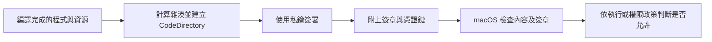
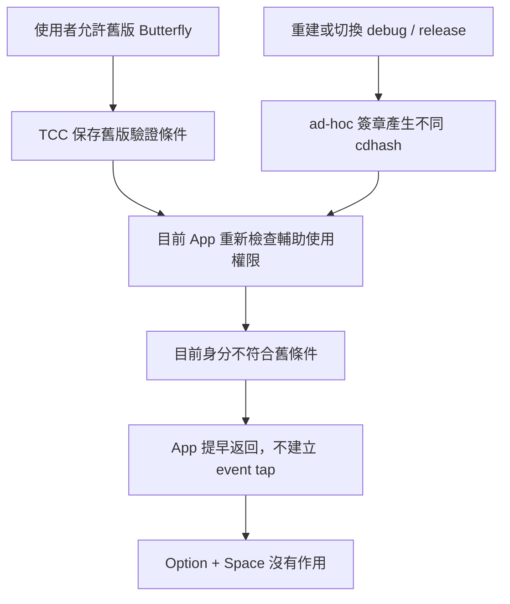

# macOS 憑證、程式簽章與輔助使用權限：從 Butterfly 的問題理解整個機制

記錄日期：2026-09-09。本文以 macOS 本機開發為主，不把 iOS、App Store 或企業受管理裝置的規則直接套用到這個工具。

**目前決定：Butterfly 保留 ad-hoc 臨時簽章，不自動建立本機憑證。** 使用者接受重建後可能需要重新授權。本文也解釋較完整的簽章方案，但那些方案並未啟用。

## 閱讀導覽

- [1. 先回答這次最重要的問題](#1-先回答這次最重要的問題)
- [2. 憑證到底是什麼？為什麼需要它？](#2-憑證到底是什麼為什麼需要它)
- [3. 程式簽章如何工作？](#3-程式簽章如何工作)
- [4. macOS 如何認出更新後仍是同一個程式？](#4-macos-如何認出更新後仍是同一個程式)
- [5. 不同的安全機制不要混為一談](#5-不同的安全機制不要混為一談)
- [6. Butterfly 實際發生了什麼？](#6-butterfly-實際發生了什麼)
- [7. 為什麼 Butterfly 使用 Accessibility？](#7-為什麼-butterfly-使用-accessibility)
- [8. 可以不要輔助使用權限嗎？](#8-可以不要輔助使用權限嗎)
- [9. 換 Go、TUI 或其他框架有幫助嗎？](#9-換-gotui-或其他框架有幫助嗎)
- [10. 開發者應如何選擇簽章方案？](#10-開發者應如何選擇簽章方案)
- [11. 目前這個專案怎麼啟動與排錯？](#11-目前這個專案怎麼啟動與排錯)
- [12. 下次再處理固定簽章時的驗收條件](#12-下次再處理固定簽章時的驗收條件)

## 1. 先回答這次最重要的問題

| 問題 | 答案 |
|---|---|
| 寫 macOS 本機工具一定要申請 Apple 憑證嗎？ | 不一定。本專案目前就是沒有 Apple 核發憑證的 ad-hoc 簽章。 |
| 每次改版都要換一張憑證嗎？ | 不需要。更新內容會產生新的程式簽章，但可以維持相容的程式身分。 |
| 為什麼設定開著，Butterfly 卻說沒權限？ | 本次查到的是舊授權綁到舊版雜湊，新版不符合該條件。 |
| 不用 Accessibility 就不用考慮簽章嗎？ | 不能這樣推論。內容完整性、執行、發布與其他隱私權限仍是不同課題。 |
| 改用 Go 或 Electron 就沒有這個問題嗎？ | 不會因換語言而自動消失；要看最終程式做什麼，以及 macOS 把權限歸給哪個程序。 |
| 可否不授予 Accessibility？ | 可以選擇不授權；若要維持實用性，應改成只顯示結果或複製後由人手動貼上。這種完整模式目前尚未實作。 |
| 我拒絕了鑰匙圈密碼，是不是已經授予 Accessibility？ | 不是。鑰匙圈操作、憑證信任與輔助使用授權是不同操作。 |

後文把通用機制、程式碼事實與這次的查核結果分開說明，不把「理論上可行」寫成「已經驗證成功」。

## 2. 憑證到底是什麼？為什麼需要它？

### 2.1 先想像沒有身分驗證的情況

假設你下載了一個叫 `Butterfly.app` 的檔案。名稱、圖示與版本號都可以被其他人複製。只看這些資訊，你無法確認它是不是原本作者做的，或下載途中是否被改過。

即使作者另外附上一個雜湊值，攻擊者若能同時替換程式與那串雜湊，仍可能騙過單純的比對。因此，要解決的問題不只有「內容是否相同」，也包含「是誰認可這份內容」。這是本文件用來理解機制的示例，不是 Butterfly 曾遭到攻擊的紀錄。

### 2.2 私鑰、公鑰與憑證各自負責什麼

| 名稱 | 作用 | 如何保管 |
|---|---|---|
| 私鑰（private key） | 產生數位簽章 | 由簽署者保管，不應提交到 Git 或交給一般使用者 |
| 公鑰（public key） | 驗證與該私鑰對應的簽章 | 可以公開 |
| 憑證（certificate） | 包裝公鑰及其身分、簽發者、有效期限、用途等資訊，並由簽發者簽署 | 通常是公開資料；單獨拿到它不能代替私鑰簽署程式 |
| 簽章身分（signing identity） | 憑證與相對應私鑰的組合 | 開發工具實際簽署程式時需要這個組合 |

憑證不是密碼，也不是輔助使用許可證。它回答的是公鑰與身分的關係。憑證與私鑰常一起包成 `.p12`，所以口語的「匯出憑證」可能其實包含私鑰；不能只看副檔名就認為檔案可公開。[Apple：Certificates](https://developer.apple.com/documentation/security/certificates)、[Apple TN3161：Digital identity](https://developer.apple.com/documentation/technotes/tn3161-inside-code-signing-certificates)

### 2.3 誰替憑證上的身分背書？

Apple 核發的憑證可以透過憑證鏈連到系統認得的簽發者。本機自簽憑證則是自己簽自己的公鑰資訊：它可以在本機方案中提供固定的驗證依據，但不等於 Apple 已確認作者身分，也不會讓別人的 Mac 自動信任這個作者。

兩者都可能用於簽署；差別在於系統或使用者憑什麼信任該身分。這也是「本機自己編譯」和「公開提供下載」應採不同流程的原因。[Apple：Code Signing Tasks](https://developer.apple.com/library/archive/documentation/Security/Conceptual/CodeSigningGuide/Procedures/Procedures.html)

## 3. 程式簽章如何工作？

以下是概念流程，省略底層檔案格式細節：



macOS 的簽章會涵蓋執行碼及相關中繼資料、資源。`CodeDirectory` 記錄相關雜湊；`cdhash` 是這個結構的雜湊，不應簡化為直接對整個 `.app` 資料夾做一次 SHA-1。受保護的內容改變後，可能需要重新簽署，新的 `cdhash` 也可能不同。[Apple TN3126：Inside Code Signing — Hashes](https://developer.apple.com/documentation/technotes/tn3126-inside-code-signing-hashes)

要區分以下三個問題：

1. **完整性**：檔案是否仍符合簽署時的內容？
2. **來源／身分**：這份程式符合哪個簽署身分？
3. **是否允許某個行為**：系統政策和使用者是否允許它執行、錄音或控制其他程式？

有效簽章不代表程式沒有 Bug，也不等於它絕對安全。它更不代表使用者已同意讓程式控制鍵盤。不同安全子系統有各自的判斷政策。[Apple TN2206：macOS Code Signing In Depth](https://developer.apple.com/library/archive/technotes/tn2206/)

### 3.1 ad-hoc 簽章不是完全沒簽章

本專案預設使用：

```bash
codesign --force --sign - .build/app/Butterfly.app
```

`-` 表示 ad-hoc：有程式內容的簽章結構，但沒有憑證式的簽署者身分。這與 Apple 開發者網站裡其他平台的「Ad Hoc 發布」名詞不可混用。

在這次 Butterfly 的實際輸出中，designated requirement 退化成特定 `cdhash` 的比對。這說明了為什麼它可以在本機執行，卻不容易沿用跨版本的授權；不表示所有 ad-hoc 程式在所有 macOS 版本與啟動方式下，都有完全相同的授權行為。

## 4. macOS 如何認出更新後仍是同一個程式？

### 4.1 名稱、路徑、Bundle ID 都不是全部

Butterfly 的 Bundle ID 是：

```text
com.butterfly.voice-dictation
```

它是開發者設定的識別字串；其他人也能在自己的檔案裡寫同樣的字串。所以只檢查 Bundle ID，不足以辨識可信的更新版本。

**Designated requirement，簡稱 DR，是程式供系統再次辨認自己的驗證條件。** 它可以結合識別字串、憑證及簽發鏈等條件。更新後的內容即使不同，只要仍符合先前保存的身分條件，就有機會沿用原授權，而不需要檔案逐位元相同。[Apple TN3127：Inside Code Signing — Requirements](https://developer.apple.com/documentation/technotes/tn3127-inside-code-signing-requirements)

### 4.2 用兩種條件比較

下面是概念式，並非建議直接貼進正式簽章指令：

```text
只認特定內容：
    這份程式的 cdhash 必須等於 OLD_BUILD_HASH

固定本機憑證的身分：
    App ID 必須相同，而且必須由指定憑證對應的私鑰簽署
```

第一種在內容雜湊改變時就不相符。第二種允許內容更新，但簽署者仍需持有對應私鑰。這裡的第二種是本機方案的設計示例，不是目前 Butterfly 啟用的機制。

### 4.3 那 Apple 或其他開發者每次更新都換憑證嗎？

不需要。**重新簽署新版程式，和重新申請／更換憑證，是兩件事。**

也不能把「永遠使用同一張憑證」當成所有產品的規則。憑證有更新與生命週期；正式開發者身分的驗證條件可能允許在同一團隊、符合指定簽發鏈與類型的前提下換證。若本機方案直接釘住單張憑證指紋，換證的影響就不同。是否相容應驗證 DR，不能只看憑證顯示名稱或 Team ID。[Apple TN3127：Requirements](https://developer.apple.com/documentation/technotes/tn3127-inside-code-signing-requirements)

## 5. 不同的安全機制不要混為一談

| 機制 | 主要解決的問題 | 不代表什麼 |
|---|---|---|
| Code signing | 程式內容完整性及可驗證身分 | 不代表已有麥克風或輔助使用權限 |
| 憑證信任／Keychain | 保存私鑰、控制私鑰存取、評估憑證信任 | 不等於授權程式操作其他視窗 |
| Gatekeeper | 評估下載或引入的程式是否符合執行政策 | 不是 Butterfly 的快捷鍵註冊成功證明 |
| Notarization（公證） | Apple 自動檢查發布軟體並提供公證票證 | 不是 App Store 審核，也不是使用者的 Accessibility 同意 |
| TCC 隱私權限 | 記錄程式對受保護資源的存取同意 | 不會替開發者修復不穩定的簽章身分 |
| Sandbox／entitlements | 約束或宣告程序可用的能力 | 不能用一個 entitlement 任意取代使用者同意 |

Gatekeeper、公證與 TCC 的具體行為會隨平台版本與發布情境而異；不能用某個指令成功，就宣稱其他層也都通過。

公證主要針對發布情境，與本次本機修復不同。Apple 說明其服務會檢查惡意內容及簽章問題，成功後產出票證，並明確區分它與 App Review。[Apple：Notarizing macOS software before distribution](https://developer.apple.com/documentation/security/notarizing-macos-software-before-distribution)

### 5.1 為什麼剛才會出現密碼或鑰匙圈授權？

固定簽章方案嘗試匯入私鑰、憑證，並設定本機 code-signing 信任。這些是鑰匙圈／信任設定操作，與在「隱私權與安全性 → 輔助使用」開啟 Butterfly 不同。

本次流程最後回報信任設定被使用者取消。**取消最後一步不必然回滾先前已完成的匯入**，因此後來另外刪除了該次身分與設定資料。這是本次工具執行結果，不是推論使用者已接受密碼。

## 6. Butterfly 實際發生了什麼？

### 6.1 使用者看到的現象

- 設定裡 Butterfly 的輔助使用開關已經打開。
- 程式仍顯示 `Accessibility Permission Required` 或 `Hotkeys unavailable`。
- 在其他程式按 Option + Space 沒反應。
- 修改程式、重建、重新啟動與重新授權交錯進行，問題反覆出現。

### 6.2 查到的證據

當次唯讀查核發現，授權紀錄的服務為 `kTCCServiceAccessibility`、client 為 `com.butterfly.voice-dictation`，允許值為 `2`。紀錄中的 code requirement 與當時執行檔不同：

| 當次查核項目 | 雜湊前綴 |
|---|---|
| 舊授權要求的 `cdhash` | `0a1db284…` |
| 當時 App 的 `cdhash` | `31213e4c…` |

**這些只是歷史證據，不應硬編碼到程式或當作下次的預期值。** TCC 資料庫欄位是實作細節；此次能讀到資料不表示一般環境都能存取，產品不應依賴它或直接修改資料庫。

問題不在於使用者看錯開關，而是「允許舊身分」與「目前身分通過檢查」並不相同。相同 Bundle ID 和相同路徑，也沒有讓這兩個雜湊相等。

### 6.3 本次因果流程



這個因果關係有當次紀錄與程式碼支持，但不能推廣成「所有 hotkey unavailable 都是簽章問題」。事件監聽建立失敗、程序未執行或其他輸入限制，也需個別排查。

### 6.4 做過哪些處理？哪些撤回了？

| 處理 | 目前狀態 |
|---|---|
| 啟動改為靜默檢查權限，未授權時每兩秒重查 | 保留 |
| 選單顯示權限／快捷鍵狀態 | 保留 |
| `./run.sh` 預設直接開已有版本，需更新才 `--build` | 保留 |
| 使用系統工具重設 Butterfly 自己的舊輔助使用授權 | 當次排錯已執行，不是每次啟動的自動流程 |
| 自動建立固定本機憑證、修改建置腳本 | 使用者取消，已撤回 |
| 嘗試建立的本機身分與 `signing.json` 等資料 | 已執行定向清理；刪除命令回報成功 |
| 驗證固定憑證下反覆重編仍保留 Accessibility | **未完成，不能宣稱通過** |

這次匯入過程也遇到 PKCS#12／私鑰格式錯誤，後來進入憑證信任設定，最終由使用者取消。它們是設定流程遇到的問題，不是「每次使用 Butterfly 都必須申請 Apple 憑證」的證據。

### 6.5 「靜默檢查」能解決什麼？

目前 `InputInjector.checkAccessibilityPermission()` 預設呼叫 `AXIsProcessTrusted()`。它讀取目前程序是否受信任，不會授權、不會改寫既有紀錄，也不會自動打開設定。

明確要求 prompt 的 API 可以提示使用者，但提示是非同步的，不會讓當次檢查立刻變成已授權。因此「不再跳視窗」和「恢復快捷鍵」是兩個獨立成果。[Apple：AXIsProcessTrustedWithOptions](https://developer.apple.com/documentation/applicationservices/1459186-axisprocesstrustedwithoptions)

## 7. 為什麼 Butterfly 使用 Accessibility？

Accessibility 在這裡是 macOS 的「輔助使用」授權，不是網站的無障礙檢查分數。程式要透過相關功能控制 Mac，需要使用者明確允許。[Apple：Allow accessibility apps to access your Mac](https://support.apple.com/guide/mac-help/allow-accessibility-apps-to-access-your-mac-mh43185/mac)

下表以目前 repository 的呼叫路徑為準：

| Butterfly 功能 | 現行實作 | 與權限的關係 |
|---|---|---|
| 擷取麥克風聲音 | `AVCaptureDevice` 授權與 `AVAudioEngine` | 麥克風權限；不是 Accessibility |
| Whisper 本機辨識 | `LocalWhisperStreamEngine` 與 whisper.cpp | 音訊送到辨識模型；計算本身不需要控制其他程式 |
| Apple Speech 辨識 | `LiveSpeechEngine.requestPermissions()` | 本專案同時請求麥克風與 Speech Recognition |
| 在任何程式按 Option + Space | App 使用 `.cgSessionEventTap`、`.defaultTap` 監看按鍵 | 現行程式先要求 Accessibility，再建立 event tap |
| 吞掉第一個 Enter／Esc | event tap callback 回傳 `nil` | 是主動攔截，不是只在自身視窗接收按鍵 |
| 即時輸入辨識文字與退格修正 | `InputInjector` 發送 `CGEvent` | 對其他程式產生輸入事件 |
| Smart Polish 自動貼上 | 寫入剪貼簿，再模擬 Cmd+V | 寫剪貼簿與替使用者按快捷鍵是兩個步驟；後者仍是控制其他程式 |
| 顯示聲波、文字、Polish 狀態 | AppKit 面板與自有資料 | 顯示本身不需要 Accessibility |

Event tap 能是被動監聽，也能是主動過濾；建立不成功可回傳空值。macOS 另有 Input Monitoring 權限，不能把「觀察輸入」「攔截輸入」「發送輸入」當成完全相同的操作。[Apple：CGEventTapCreate](https://developer.apple.com/documentation/coregraphics/cgevent/tapcreate(tap:place:options:eventsofinterest:callback:userinfo:))、[Apple：Input Monitoring](https://support.apple.com/guide/mac-help/control-access-to-input-monitoring-on-mac-mchl4cedafb6/mac)

實作對照：[App 快捷鍵與狀態](../Sources/ButterflyApp/ButterflyApp.swift)、[文字注入與信任檢查](../Sources/ButterflyCore/Injector/InputInjector.swift)、[Whisper 錄音](../Sources/ButterflyCore/Engine/LocalWhisperStreamEngine.swift)、[App 打包與簽章](../Scripts/build-app.sh)。

### 7.1 是因為用到 Accessibility 才「需要憑證」嗎？

更精確的說法是：**Accessibility 讓程式身分是否能跨版本保持相容，成為使用者立即會遇到的問題。**

Accessibility 不等於規定所有本機工具都必須購買 Apple 憑證；本次 ad-hoc 版本也曾透過授權使用。問題在於更新後的身分比對。即使拿掉它，麥克風等權限、程式執行與未來的發布流程仍需個別考慮。

## 8. 可以不要輔助使用權限嗎？

可以，但要改變工具的互動模式。以下是可行方向的架構分析，**不是已提供的開關**：

| 模式 | 如何開始／停止 | 如何取得文字 | 保留什麼、犧牲什麼 |
|---|---|---|---|
| 現有全域聽寫 | 全域快捷鍵，攔截 Enter／Esc | 自動輸入游標位置 | 最方便，但依賴目前的權限路徑 |
| 本機錄音面板 | 自己的按鈕 | 面板顯示文字、使用者自行複製 | 可以保留聲波與 Polish，不能保證在其他程式按 Enter 就停止 |
| CLI／TUI 手動模式 | 終端機裡的按鍵 | stdout、檔案或複製按鈕 | 不控制其他 App，操作需回到終端機 |
| 複製後人工貼上 | 按鈕或本機命令 | 文字寫入剪貼簿，使用者自己 Cmd+V | 不需要程式模擬貼上，也沒有串流游標注入 |

`NSPasteboard` 是讀寫剪貼簿的介面。**把結果放上剪貼簿，不等於讓另一個程式立刻貼上。** 本專案若採人工貼上模式，應移除模擬 Cmd+V 的那一步，並明確管理剪貼簿替換，不能只換 API 名稱就宣稱不用 Accessibility。[Apple：NSPasteboard](https://developer.apple.com/documentation/appkit/nspasteboard)

真正的免 Accessibility 模式至少需要：

1. 使用自身 UI 或終端機處理開始／停止，不依賴現在的全域 event tap。
2. 移除自動 Unicode 打字、退格及模擬 Cmd+V。
3. 提供顯示、輸出或人工複製的文字路徑。
4. 修改提示，取消「在別的程式按第一個 Enter 會被吞掉」的承諾。
5. 麥克風仍走正常授權；Apple Speech 路徑依其 API 要求處理辨識授權。

麥克風權限有獨立的用途說明及授權流程，不能因為不需要輔助使用，就省掉麥克風權限。[Apple：Requesting Authorization for Media Capture on macOS](https://developer.apple.com/documentation/bundleresources/requesting-authorization-for-media-capture-on-macos)

全域快捷鍵本身也有不同實作方式，不宜宣稱所有快捷鍵都必須要求 Accessibility。只是改掉快捷鍵 API，不會順便解決目前自動輸入與攔截 Enter 的需求。

## 9. 換 Go、TUI 或其他框架有幫助嗎？

下面是根據本專案所需功能做的工程判斷，並非各框架的完整支援矩陣：

| 方向 | 對本次問題的影響 |
|---|---|
| Swift／AppKit | 直接使用 macOS API，簽章和權限責任比較明顯 |
| Electron／Tauri／Flutter／Qt | 可以換 UI 與打包工具；若透過原生橋接控制其他 App，仍需處理平台限制 |
| Go＋TUI，只錄音並輸出結果 | 可把產品改成不控制其他程式；不是因 Go 有特權，而是需求減少了 |
| Go＋TUI，保留所有全域聽寫能力 | 仍須接 macOS 錄音與輸入 API，不能只靠重寫消除授權 |
| 固定的 macOS 輔助程序＋常更新的辨識服務 | 可減少權限持有程序更新次數；該程序本身改版時，身分問題仍存在 |

本 repo 已有 whisper.cpp 的 C bridge，Go 方案可能重用 C 層；但聲波面板、音訊擷取、事件攔截、游標注入與 Apple 原生功能都要重新接。這是架構改造，不是解決簽章的必要前提。

從 Terminal、Ghostty 或其他啟動器執行 CLI，權限的責任程序歸屬還可能不同。**不能承諾把它改成 `go run` 或 `swift run`，就一定能沿用終端機授權。** 需要在目標 macOS、啟動方式與功能上實測；本次沒有完成這項驗證。

## 10. 開發者應如何選擇簽章方案？

### 10.1 本機原型：接受重建後偶爾重新授權

這是目前選擇。維持 ad-hoc，避免日常啟動不必要地重建；需要新程式碼才明確 build。它降低操作頻率，**不是根治跨版本身分問題**。

每次 build 不一定都產生不同雜湊：相同產物可能保持相同；但程式、資源、建置配置或簽署資料改變，都不應假設仍相同。應檢查實際輸出，而不是用「一定每次失效」描述。

### 10.2 常態本機開發：固定本機簽章身分

這是曾提出、後來取消的方案。合理實作應保存私鑰與憑證，在每次 build 重用，並保持 App ID 與驗證條件一致。它不需要對外申請 Apple 身分，但仍可能需要本機鑰匙圈確認。

自簽憑證不會自動授予 TCC，也不是讓其他使用者不用首次授權的方法。若恢復此方案，應以實際跨重編驗收為準，不能只看 `codesign` 成功。[Apple：Code Signing Tasks](https://developer.apple.com/library/archive/documentation/Security/Conceptual/CodeSigningGuide/Procedures/Procedures.html)

### 10.3 對外發送可下載的 macOS 程式

通常採 Developer ID 簽署與 Apple 公證流程，與目前「只在自己的電腦上使用」分開。公證流程另有 Hardened Runtime、時間戳記等要求，不能直接把本地簽章指令當成完整發布腳本。使用者取得的是簽好的產物，不需要持有作者私鑰；首次隱私授權仍由使用者決定。[Apple：Notarizing macOS software before distribution](https://developer.apple.com/documentation/security/notarizing-macos-software-before-distribution)

### 10.4 提供原始碼，讓別人自己 build

應文件化兩條路：使用 ad-hoc 並接受授權重設成本，或由每位開發者管理自己的固定本機身分。不要把作者私鑰提交到 repository，讓所有人共用來解決問題。

憑證到期、撤銷、更換私鑰與遷移電腦都屬於身分生命週期，不能用「永久不需管理」保證任何憑證方案。程式簽章、信任評估與簽署時間等因素也會影響驗證，不能一概說憑證到期後所有既有 App 都立即失效。[Apple TN2206：Code signing in depth](https://developer.apple.com/library/archive/technotes/tn2206/)

## 11. 目前這個專案怎麼啟動與排錯？

### 11.1 產物在哪裡？

在 repository 根目錄下：

```text
.build/app/Butterfly.app
```

`.app` 是有特定結構的資料夾，裡面包含執行檔、`Info.plist`、資源與簽章資料；使用這種封裝不等於要上架 App Store。

```bash
# Show the exact app in Finder.
open -R .build/app/Butterfly.app
```

### 11.2 日常啟動與更新

```bash
# Open the existing app; build it if no app exists yet.
./run.sh

# Apply source changes, rebuild, and launch.
./run.sh --build

# Explicitly build the debug version.
./run.sh --debug

# Open an existing app only; fail if no app exists.
./run.sh --no-build
```

`swift build` 與 `./run.sh --build` 不相同：前者編譯 Swift Package 產物；後者還會執行 App 打包與簽章。因此只跑 `swift build`，不代表 `.build/app/Butterfly.app` 已更新。

目前建置腳本仍接受 `BUTTERFLY_CODESIGN_IDENTITY`，未設定時預設為 `-`。它只是覆寫入口，不會自動建立、保存或修復固定憑證；不是已完成的憑證管理方案。

### 11.3 安全的唯讀檢查

```bash
# Inspect the identity, signature type, and designated requirement.
codesign -d -vv -r- .build/app/Butterfly.app

# Check the on-disk signature integrity.
codesign --verify --deep --strict .build/app/Butterfly.app
```

第二個指令成功只表示這項簽章驗證通過，**不表示目前程序已有 Accessibility，也不表示 event tap 已註冊**。此外，磁碟上的檔案可能與尚未退出的舊程序不同，因此需要確認沒有跑錯版本。

### 11.4 快捷鍵沒反應時的順序

1. 確認 Butterfly 正在執行，並看選單詳細狀態，而不只看 menu bar 的簡短提醒。
2. `Accessibility Permission Required` 表示目前程序的信任檢查失敗，尚未嘗試建立 event tap。
3. `Unavailable — Check Accessibility` 表示已進到 event tap 建立流程，但建立失敗；不是同一個分支。
4. `Ready` 表示註冊曾成功；若仍沒反應，應繼續查實際事件輸入與錄音啟動，而不是直接重設權限。
5. 若剛重建過且權限不符，到輔助使用設定移除舊項目，再加入 Finder 顯示的目前 App。等待程式重新檢查；必要時結束並重開同一份產物，不必為了重啟再 build。

若一般重新加入仍無法解除舊紀錄，可**手動、針對 Butterfly**執行以下重設：

```bash
# Reset only Butterfly's Accessibility authorization.
# This does not grant access; enable it again in System Settings afterward.
tccutil reset Accessibility com.butterfly.voice-dictation
```

這是排錯操作，不應放進每次啟動腳本。不要改成 `tccutil reset All` 或重設所有程式的 Accessibility。`tccutil reset` 的用途是移除已記錄的決定，不是直接授權。[Apple：Resetting access to protected resources in macOS](https://developer.apple.com/documentation/xcode/resetting-access-to-protected-resources-in-macos)

## 12. 下次再處理固定簽章時的驗收條件

這份紀錄的目的也包含避免重複犯同樣的排錯錯誤。未來若重新採用固定身分，至少需要以下證據：

- 兩份內容不同的程式，雜湊可以不同，但都符合相同的身分驗證條件。
- 用錯憑證或 App ID 的程式不能通過；不能只放寬成比對名稱。
- 在授予一次權限後，重新啟動、修改程式後重編、debug／release 切換、清除 `.build` 後重建，都要實測。
- 麥克風、Option + Space、聲波、第一個 Enter 的攔截與文字輸入要分別驗證。
- 簽章設定錯誤時停止建置，保留舊版，不偷偷產生新身分或重設 TCC。
- 未經使用者授權，不把鑰匙圈或系統信任變更當成普通檔案操作。
- 記錄已完成與未完成的驗證。單元測試、編譯成功及 `codesign --verify` 都不能代替真機隱私授權驗收。

目前保留 ad-hoc 是使用者明確選擇的取捨；本文不代表再次批准建立憑證，也不代表固定簽章方案已完成。
