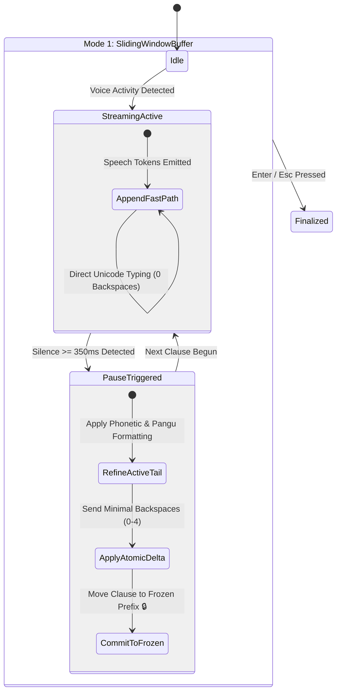

# 🦋 Mode 1 Sliding Window & Pause-Gated Refiner Architecture

This document specifies the architecture and state machine implementation for **Butterfly Mode 1 (Live Streaming Dictation)** on macOS.

---

## 🎯 Design Goals

1. **Ultra-Low Latency (< 30ms)**: Words stream forward directly into the active focused cursor (`Append-Only`) while speaking.
2. **Zero Screen Flickering**: History sentences are locked in a **Frozen Prefix** and are never modified or backspaced.
3. **Silence Pause-Gated Refinement (350ms)**: Contextual self-healing (e.g. `contact` $\rightarrow$ `Context`, `800 MB`, Pangu spacing) triggers cleanly only during natural speech pauses.

---

## 🏛️ State Machine Diagram

---

## 🧩 Components

- **[`SlidingWindowBuffer.swift`](file:///Users/daniel_y_yang/Documents/self/butterfly/Sources/ButterflyCore/Text/SlidingWindowBuffer.swift)**:
  - Manages `frozenText`, `activeTail`, and `injectedTail`.
  - Implements `computeMinimalDelta` to calculate minimum backspaces and replacements.
- **[`InputInjector.swift`](file:///Users/daniel_y_yang/Documents/self/butterfly/Sources/ButterflyCore/Injector/InputInjector.swift)**:
  - Executes atomic `SlidingDeltaAction` (`.append`, `.replaceTail`, `.noChange`).
- **[`ButterflyApp.swift`](file:///Users/daniel_y_yang/Documents/self/butterfly/Sources/ButterflyApp/ButterflyApp.swift)**:
  - Connects `LiveSpeechEngine` to `SlidingWindowBuffer` with a 350ms non-blocking pause timer.
