# 🦋 Butterfly: Mode 2 雙軌模型架構與本地 SLM 深度重構設計書 (Mode 2 Dual-Track Architecture)

> **文件位置**：`docs/MODE2_SLM_ARCHITECTURE.md`  
> **關聯規範**：[`docs/ARCHITECTURE.md`](ARCHITECTURE.md) | [`docs/TEST_PLAN.md`](TEST_PLAN.md) | [`SYSTEM_PROMPT.md`](../SYSTEM_PROMPT.md)

---

## 1. 核心願景與設計動機 (Vision & Motivation)

在 Butterfly 的操作模型中：
- **Mode 1（即時串流聽寫）**：追求 **100% 忠實、零刪字、極低延遲（<30ms）** 敲入游標。
- **Mode 2（錄音智慧筆記）**：追求 **深度認知摘要、邏輯重構與行動清單結構化**。

為了讓 Mode 2 達到頂級人類助理水準，我們將系統推論層升級為 **「雙軌模型白名單架構（Dual-Track Model Whitelist Architecture）」**：
1. **Track A（語音轉文字 ASR）**：負責 100% 精準將長篇音訊轉譯為原始逐字稿。
2. **Track B（認知語言模型 SLM）**：負責在本地端對逐字稿執行深度思維鏈（CoT）推理、修辭潤飾與 Markdown 結構化輸出。

---

## 2. 雙軌模型白名單與自動降級策略 (Dual-Track Model Matrix)

```mermaid
graph TB
    subgraph TrackA ["🎙️ Track A：語音轉文字模型 (Speech-to-Text ASR)"]
        ASR1["Rank 1: Whisper Large-v3-Turbo (848 MB) ⭐ [強烈推薦]"]
        ASR2["Rank 2: Whisper Small (466 MB)"]
        ASR3["Rank 3: Whisper Base (145 MB)"]
        ASR4["Rank 4: Whisper Tiny (75 MB)"]
        ASR_Native["Rank 5 (內建預設): Apple Speech Native (0 MB, 零下載)"]
    end

    subgraph TrackB ["🧠 Track B：智慧筆記語言模型 (Language Model SLM)"]
        SLM1["Rank 1: Qwen2.5-0.5B-Instruct (~350 MB) ⭐ [繁中與邏輯首選]"]
        SLM2["Rank 2: Llama-3.2-1B-Instruct (~700 MB) [英文與摘要強]"]
        SLM_Native["Rank 3 (內建預設): Built-in Cognitive Rule Engine (0 MB, 零下載)"]
    end

    subgraph Mode2Execution ["⚡ Mode 2 執行流程 (Option+Shift+Space 錄音 -> Enter 結束)"]
        AudioInput["長篇口述音訊"] --> TrackA
        TrackA -->|高精確度原始逐字稿| TrackB
        TrackB -->|頂級結構化 Markdown 筆記| SafePaste["防誤送安全貼入 (CGEventTap Swallowed Enter)"]
    end
```



### 降級與選用規則 (Priority & Fallback Rule)：
1. **預設先用最強的**：若本機快取目錄（`~/.cache/butterfly/models/`）已下載 Rank 1 模型，系統啟動時自動鎖定 Rank 1。
2. **零門檻優雅降級**：若使用者尚未下載任何大模型，系統自動降級至 `Apple Speech Native` + `Built-in Cognitive Rule Engine`，**佔用 0 MB 下載空間即可立即可用**！

---

## 3. Apple 原生語言模型能力評估 (Apple Native SLM Analysis)

針對 macOS 系統內建的語言處理能力進行技術剖析：

| 架構類別 | 技術細節 | Mode 2 適用性與限制 |
| :--- | :--- | :--- |
| **`NaturalLanguage.framework`** (macOS 10.14+) | 傳統統計與詞向量模型 (`NLEmbedding`, `NLTokenizer`, `NLModel`) | ❌ **無生成式推理能力**。僅能計算詞彙相似度與語意標籤，無法理解口語長文並生成結構化摘要。 |
| **`Apple Intelligence (AFM)`** (macOS 15.1+) | 系統級 3B Foundation Model | ⚠️ **無底層任意 Prompt 開發者 API**。目前 Apple 僅開放系統 UI 綁定元件（`NSWritingToolsCoordinator`），未提供 Swift Package 直接呼叫之純文字生成介面。 |
| **`Apple Silicon Metal / ANE SLM`** *(本專案採用方案)* | 本地端量化超輕量小語言模型 (0.5B ~ 1B) | ✅ **100% 本地、推論極速（80+ tokens/s）、專為筆記打造**。<br/>• **Qwen2.5-0.5B (~350MB)**：中文理解力極強，記憶體負擔極小。<br/>• **Llama-3.2-1B (~700MB)**：邏輯結構與摘要能力頂尖。 |

---

## 4. Menu Bar (狀態列選單) 與 CLI 介面設計

### 4.1 macOS Menu Bar 狀態選單

```text
🦋 Butterfly (Ready)
├── 🎙️ Mode 1: Live Streaming Dictation (Option+Space)
├── 📝 Mode 2: Record & Smart Polish (Option+Shift+Space)
├── ⏹️ Stop Recording (Enter / Esc)
├── ──────────────────────────────────────────
├── 🎙️ Speech Recognition (ASR)           ▸
│   ├── ✓ Whisper Large-v3-Turbo (848 MB) [Active]
│   ├──   Whisper Small (466 MB) [Download]
│   ├──   Whisper Base (145 MB) [Download]
│   ├──   Whisper Tiny (75 MB) [Download]
│   └──   Apple Speech Native (Built-in)
├── 🧠 Smart Note Language Model (SLM)    ▸
│   ├── ✓ Qwen2.5-0.5B-Instruct (~350 MB) [Active]
│   ├──   Llama-3.2-1B-Instruct (~700 MB) [Download]
│   └──   Built-in Cognitive Rule Engine (Built-in)
├── ──────────────────────────────────────────
└── 🚪 Quit Butterfly
```

### 4.2 CLI 指令擴充

```bash
# 1. 檢視 ASR 與 SLM 雙軌模型清單與下載狀態
swift run butterfly-cli models

# 2. 下載指定模型至本機快取
swift run butterfly-cli download whisper-large-v3-turbo
swift run butterfly-cli download qwen2.5-0.5b-instruct

# 3. 測試雙軌 Mode 2 深度筆記重構效果
swift run butterfly-cli test-polish --slm
```

---

## 5. 模組實作與代碼變更清單 (Component Changes)

1. **`Sources/ButterflyCore/Engine/LanguageModelBackend.swift`** [NEW]：
   - 定義 `LanguageModelBackend` 協定。
   - 實作 `LocalSLMInferenceBackend` 與 `BuiltinCognitiveBackend`。
2. **`Sources/ButterflyCore/Engine/ModelManager.swift`** [MODIFY]：
   - 擴充 `ModelCategory`（`.speechToText` 與 `.languageModel`）。
   - 實作雙軌模型探測與下載邏輯。
3. **`Sources/ButterflyApp/ButterflyApp.swift`** [MODIFY]：
   - 重構 NSMenu 建立兩個獨立子選單，支援雙軌即時切換。
4. **`Sources/ButterflyCLI/main.swift`** [MODIFY]：
   - 支援分類顯示與下載 SLM 模型。
